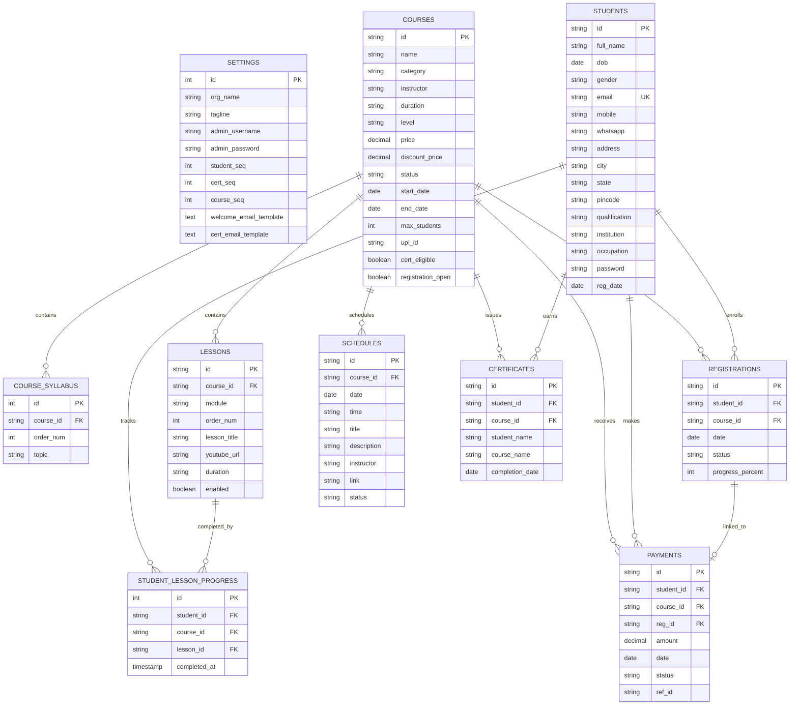

# CourseHub Academy — Database & Architecture Documentation

## 1. Project Analysis

The CourseHub folder contains a single-page Learning Management System (LMS) application designed for student enrollment, online video learning, UPI payment tracking, progress tracking, and certificate generation, along with a full administrative portal.

### Key Functional Components:
1. **Student Lifecycle**:
   - Registration & Authentication (Email / Student ID + Password)
   - Course discovery, enrollment, and pricing calculation (regular vs. discount prices)
   - UPI payment submission with transaction reference ID tracking
   - Video lessons with YouTube embed support, sequential lesson locking, and completion tracking
   - Automated certificate generation with downloadable HTML5 Canvas certificate images
2. **Admin Operations**:
   - Course catalog CRUD (pricing, syllabus, status, max enrollments)
   - Lesson builder (modules, YouTube URL, ordering, enable/disable)
   - Payment verification and enrollment activation/rejection
   - Live session scheduler (webinars, Google Meet / YouTube links)
   - System settings (branding, email templates, ID sequence counters)
   - Excel Import & Export (`xlsx`) for students, courses, enrollments, and payments
3. **Data Layer Evolution**:
   - **Initial State**: Stored solely in client-side browser `localStorage` via mock seed in `database.js`.
   - **New Relational Database**: Production-grade relational database with normalized 3NF schema, ACID compliance, foreign key constraints (`ON DELETE CASCADE`), indexes, analytical views, and an SQLite database (`coursehub.db`).

---

## 2. Entity-Relationship (ER) Diagram



---

## 3. Database Schema Reference

| Table Name | Primary Key | Foreign Keys | Description |
| :--- | :--- | :--- | :--- |
| `settings` | `id` (1) | None | Academy configuration, admin login credentials, sequence numbers, email templates |
| `courses` | `id` (e.g. `CRS-001`) | None | Course metadata, instructor, pricing, discount, dates, capacity, UPI handle |
| `course_syllabus` | `id` (Auto-inc) | `course_id` $\rightarrow$ `courses.id` | Normalized ordered syllabus items for courses |
| `lessons` | `id` (e.g. `L1`) | `course_id` $\rightarrow$ `courses.id` | Modules, lesson titles, video URLs, order, duration |
| `students` | `id` (e.g. `STU-2026-0001`) | None | Student accounts, unique email, contact info, qualifications, password |
| `registrations` | `id` (e.g. `REG-1001`) | `student_id`, `course_id` | Enrollment junction, completion percentage, active/pending status |
| `payments` | `id` (e.g. `PAY-2001`) | `student_id`, `course_id`, `reg_id` | UPI transactions, amounts, verification state (`Submitted`, `Verified`, `Rejected`) |
| `student_lesson_progress` | `id` (Auto-inc) | `student_id`, `course_id`, `lesson_id` | Individual lesson completion timestamps per student |
| `certificates` | `id` (e.g. `CERT-2026-00001`) | `student_id`, `course_id` | Issued certificates with completion date and student details |
| `schedules` | `id` (e.g. `SCH-1`) | `course_id` $\rightarrow$ `courses.id` | Live webinars, timetable, meeting links |

### Analytical Views
- **`v_course_stats`**: Summarizes each course with total lessons, total enrolled students, and total verified revenue generated.
- **`v_pending_payments`**: Lists all payments awaiting admin verification with student and course details.

---

## 4. How to Use the Database

### Option A: Running the Application with the SQLite Database
Start the native Node.js backend server:
```bash
node server.js
```
- Opens at: `http://localhost:3000`
- Automatically reads and writes directly to `coursehub.db`
- Data changes (signups, course edits, payments) are immediately persisted in SQLite!

### Option B: Re-initializing or Resetting the SQLite Database
To rebuild `coursehub.db` cleanly from the schema and seed scripts:
```bash
node init_db.js
```

### Option C: Using with MySQL or PostgreSQL
The provided `schema.sql` and `seed.sql` files follow ANSI SQL standards and can be directly imported into MySQL or PostgreSQL:
```bash
# PostgreSQL
psql -U username -d coursehub -f schema.sql
psql -U username -d coursehub -f seed.sql

# MySQL
mysql -u username -p coursehub < schema.sql
mysql -u username -p coursehub < seed.sql
```

---

## 5. REST API Endpoints Provided by `server.js`

- `GET /api/db` — Retrieves the entire database structured for the frontend.
- `POST /api/sync` — Persists the frontend dataset to the SQLite database.
- `GET /api/stats` — Returns high-level statistics, course breakdowns, and pending payment verifications.
- `POST /api/reset` — Resets the database to initial seed data.
